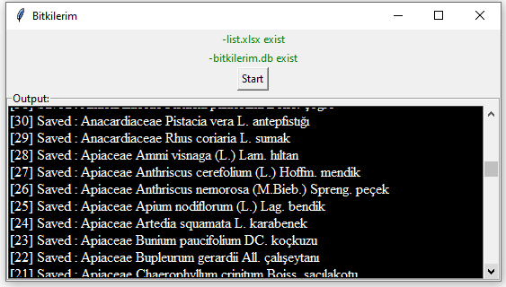

# bitkilerim
bizimbitkiler.org.tr sitesinden excel listesinde yazılı olan bitkilerin yazar, element ve endemik olup olmadıkları bilgilerini getirir.

-Aramanın yapılacağı kaynak liste list.xlsx adına olmalı ve sütunlar aşağıdaki gibi olmalıdır.

+---------+------+-----+--------+---------+-----------+-------+-----------+---------+---------+

| FAMILYA | CINS | TUR | ALTTUR | VARYETE | TURADI_TR | YAZAR | ENDEMIKMI | ELEMENT | SITE_ID |

+---------+------+-----+--------+---------+-----------+-------+-----------+---------+---------+

-İlk arama "TUR" sütunundaki değerlere göre yapılır. Daha sonra "VARYETE" ve  "ALTTUR" sütunundaki değerlere göre bir arama daha gerçekleştirilir.
-exportData.xls adında bir dosya oluşturulup işlemler sonlanır.

